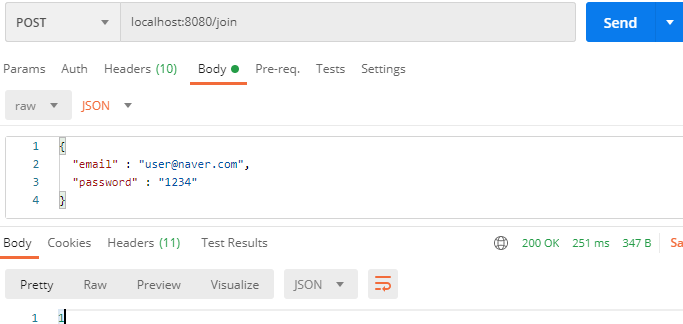
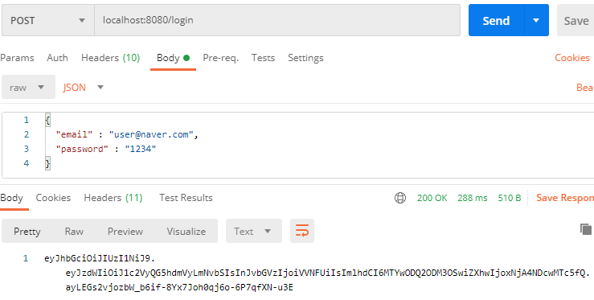
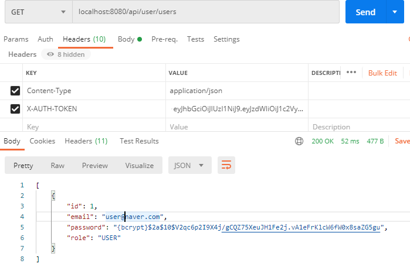

# SpringBoot - Jwt 구현 예제 (Not Refresh Token)


### WebSecurityConfig
```java
@RequiredArgsConstructor
@EnableWebSecurity
public class WebSecurityConfig extends WebSecurityConfigurerAdapter {

    private final JwtTokenProvider jwtTokenProvider;

    @Bean
    public PasswordEncoder passwordEncoder() {
        return PasswordEncoderFactories.createDelegatingPasswordEncoder();
    }

    @Bean
    @Override
    public AuthenticationManager authenticationManagerBean() throws Exception {
        return super.authenticationManagerBean();
    }

    @Override
    protected void configure(HttpSecurity http) throws Exception {
        System.out.println("WebSecurityConfig.configure");
        http
                .httpBasic().disable() // rest api만을 고려하여 기본 설정 해제
                .csrf().disable() // csrf 보안 토큰 disable

                .sessionManagement()
                    .sessionCreationPolicy(SessionCreationPolicy.STATELESS)  // 토큰 기반 인증이므로 세션 역시 사용하지 않습니
                .and()
                .addFilter(new JwtAuthenticationFilter(authenticationManager(), jwtTokenProvider))
                .authorizeRequests() // 요청 권한에 대한 사용 권한 체크
                    .antMatchers("/api/user/**").hasRole(Role.USER.name())
                    .antMatchers("/api/admin/**").hasRole(Role.ADMIN.name())
                .anyRequest().permitAll();

    }

}

```

### User Domain
```java

@Getter
@NoArgsConstructor
@AllArgsConstructor
@Builder
@Entity
public class User {
    
    @Id
    @GeneratedValue(strategy = GenerationType.IDENTITY)
    private Long id;

    @Column(length = 100, nullable = false, unique = true)
    private String email;

    @Column(length = 300, nullable = false)
    private String password;

    @Enumerated(EnumType.STRING)
    private Role role;

}
```

### Role Enum Class
```java
@Getter
@RequiredArgsConstructor
public enum Role {

    USER("ROLE_USER", "유저"),
    ADMIN("ROLE_ADMIN", "관리자");

    private final String code;
    private final String description;

}
```

### UserController
```java

@RestController
@RequiredArgsConstructor
public class UserController {

    private final PasswordEncoder passwordEncoder;
    private final JwtTokenProvider jwtTokenProvider;
    private final UserRepository userRepository;

    // 회원가입
    @PostMapping("/join")
    public Long join(@RequestBody Map<String, String> user) {
        return userRepository.save(User.builder()
                .email(user.get("email"))
                .password(passwordEncoder.encode(user.get("password")))
                .role(Role.USER)
                .build()).getId();
    }

    // 로그인
    @PostMapping("/login")
    public String login(@RequestBody Map<String, String> user) {

        System.out.println("UserController.login");

        User member = userRepository.findByEmail(user.get("email"))
                .orElseThrow(() -> new IllegalArgumentException("가입 되지 않은 EMAIL 입니다"));
        
        if (!passwordEncoder.matches(user.get("password"), member.getPassword()))
            throw new IllegalArgumentException("잘못된 비밀번호 입니다");

        String token = jwtTokenProvider.createToken(member.getEmail(), member.getRole());
        System.out.println("token = " + token);
        return token;
    }

    @GetMapping("/api/user/users")
    public List<User> simpleApiRequest() {
        System.out.println("UserController.ok");
        return userRepository.findAll();
    }

}

```

### 회원가입 요청 

> method: post  
> url :  /join  
> param : email, password   
> return : UserId  


### 로그인 요청

로그인 
> method : post  
> url : /login  
> param : email, password  
> return : Jwt 토큰  



로그인 요청을 보내서 로그인에 성공하게 되면 
토큰을 만들어 리턴해준다 


### 자원 요청 프로세스



헤더의 x-auth-token 키에 위에서 받은 Jwt토큰을 넣어 요청하면

1. `JwtAuthenticationFilter.doFilterInternal` 에서 요청을 받아 요청에서 토큰을 꺼내어 토큰이 유효한지 확인하고 토큰이 유효하다면
   
2. `JwtTokenProvider.getUsernameFromToken` 에서 토큰에 저장된 username을 꺼내어
   
3. `CustomUserDetailService.loadUserByUsername`에서 username으로 실제 DB에 저장된 데이터랑 비교하고, 존재한다면
   
4. `PrincipalDetails` 객체를 만들어
5. `JwtTokenProvider.getAuthentication` 에서 `UsernamePasswordAuthenticationToken`을 만들어 
6. `SecurityContextHolder의 Context`에 인증 객체를 저장하여 요청에 알맞는 응답을 해준다. 

